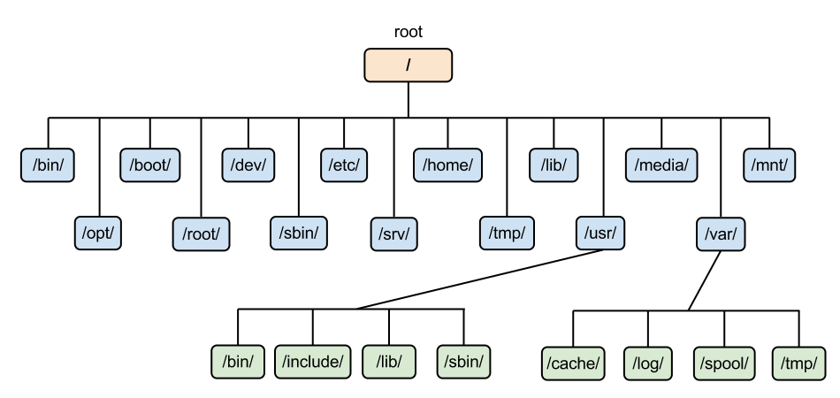
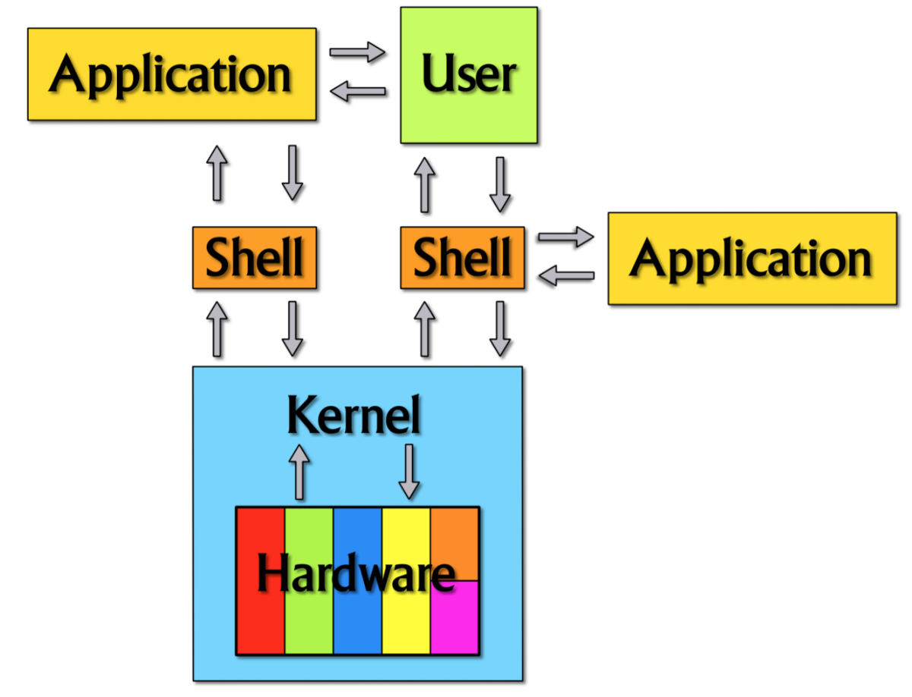
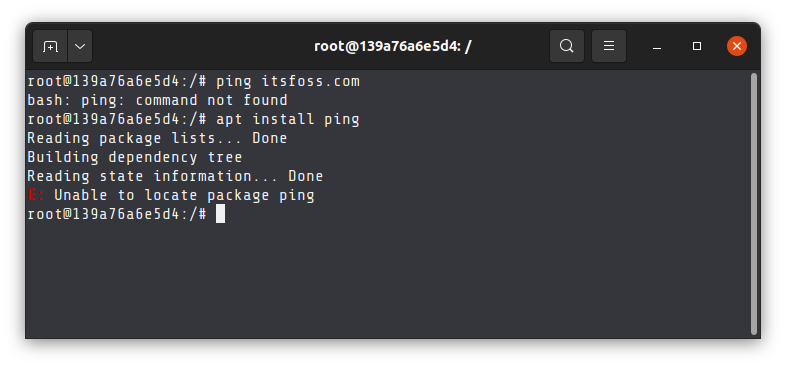

# Linux
Linux è un Kernel, creato nel 1991 da Richard Stallman, utilizzato principalmente nei Sistemi Operativi **Unix-like** come Ubuntu, ParrotOS, Fedora, ecc.

## Organizzazione e filosofia
La filosofia, analizzata da [linuxtutorials4u](https://linuxtutorials4u.wordpress.com/2011/09/03/linux-principles/), che sta dietro alle Distribuzioni Linux è la seguente:

1. **Ogni cosa è un file** (Hardware compreso!): Tutti i file di configurazione per i vari servizi in esecuzione sul sistema operativo Linux sono archiviati in uno o più file di testo.
2. **Programmi semplici**: Unix offre molti e semplici strumenti diversi, che possono essere combinati per eseguire operazioni più complesse.
3. **Dati di configurazione salvati come testo**: La memorizzazione della configurazione nel testo consente a un amministratore di spostare facilmente una configurazione da una macchina all'altra.

Tutti i file testuali di configurazione vengono salvati in una struttura a cartelle come illustrato dall'immagine sottostante:


<figure class="image">
  
  <figcaption align="center">Unix File System, <a href="https://ma-no.org">ma-no.org</a></figcaption>
</figure>

| Percorso | Descrizione |
|:-:|--|
| `/` | directory radice (root) |
| `/bin/` | contiene i binari dei comandi eseguibili dal sistema |
| `/opt/` | riservata a tutto il software e ai pacchetti aggiuntivi che non fanno parte dell'installazione predefinita |
| `/boot/` | contiene tutti i file necessari al Boot Loader per l'avvio del Sistema Operativo|
| `/root/` | home dell'utente `root` |
| `/dev/` | i file descrittori dei dispositivi quali HardDisk |
| `/sbin/` | contiene i binari del sistema |
| `/etc/` | contiene i file di configurazione e di controllo del sistema |
| `/srv/` | contiene i dati per i servizi offerti dal sistema  |
| `/home/` | cartella principale dell'utente dove vengono salvati i file locali |
| `/tmp/` | utilizzata per salvare file temporanei |
| `/lib/` | contiene le librerie essenziali |
| `/usr/` | contiene i pacchetti del sistema e le applicazioni dell'utente |
| `/media/` | contiene cartelle per la gestione dei dispositivi media montati automaticamente |
| `/var/` | contiene elementi soggetti a modifiche come Siti Web o Database |
| `/mnt/` | utilizzata per montare manualmente i filesystem temporanei dei dispositivi rimovibili |

**Cos'è un Sistema Operativo (OS)?**
Un OS (acronimo di Operating System) è un Software che raggruppa diversi componenti che semplificano l'utilizzo e la gestione delle risorse Hardware e Software fornendo dei servizi applicativi di base come, per esempio, l'interfaccia grafica (Desktop).

I **componenti** del **OS** sono i seguenti:
|Livello|Descrizione|
|:-:|--|
|Hardware| Dispositivi fisici che costituiscono il computer (CPU, RAM, HDD, SSD, ecc.) |
|Kernel| Fornisce una via di comunicazione tra la Shell e l'Hardware |
|Shell| Un'interfaccia che permette di eseguire comandi di base |
|System Utility| Rende disponibili all'utente tutte le funzionalità del sistema operativo. |

<figure class="image" align="center">
  
  <figcaption>Componenti del Sistema Operativo</figcaption>
</figure>

## Shell
Abbiamo visto che il terminale Linux (o Shell) fornisce un'interfaccia tra l'utente e il Kernel per l'esecuzione di comandi di base. L'interfaccia di una shell può essere grafica (GUI), testuale (TUI) o a riga di comando (CLI).
La Shell più utilizzata nei sistemi Unix-Like è la BASH (Bourne-Again Shell), tutto ciò che faccio con la GUI è possibile farlo anche tramite BASH (CLI).

<figure class="image" align="center">
  
  <figcaption>Terminale Ubuntu</figcaption>
</figure>

Il formato di default del Terminale è il seguente e ci permette di ottenere informazioni come l'utente che sta eseguendo il comando e in quale directory:

```bash
<username>@<hostname><directory>$
```

### Comandi di base

|Comando|Descrizione|Esempio|
|:-:|--|:-:|
|`nano`| Permette di modificare il contenuto di un file, se il file non esiste viene creato | `nano test.txt`|
|`whoiam`| Mostra il nome utente dell'attuale utente | |
|`hostname`| | `` |
|`ps`| | `` |
|`who`| | `` |
|`lsof`| | `` |

> **Tip**: per ottenere informazioni riguardandi l'utilizzo di un comando è possibile utilizzare `man <comando>` o, in alcuni casi, potremmo anche avvalerci della flag `-h` (o `--help`) come il comando stesso già fornisce: `<comando> -h`.