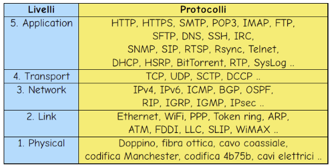

# Protocolli
Dopo aver visto il [modello ISO/OSI e TCP/IP](../../02-introduction-to-networks/README.md) possiamo parlare dei protocolli che operano al Layer 7 nel modello ISO/OSI o al Layer 5 del modello TCP/IP e che oggigiorno vengono maggiormente utilizzati per fornire servizi essenziali.

<figure class="image" align="center">
  
  <figcaption>Protocolli</figcaption>
</figure>

**Protocolli**:
  1. IEEE 802.3
  2. ICMP
  3. [DNS](/01-introduction-and-fundamentals/02-introduction-to-networks/01-main-protocols-used/dns/README.md)
  4. [SSH](/01-introduction-and-fundamentals/02-introduction-to-networks/01-main-protocols-used/ssh/README.md)
  5. [FTP](/01-introduction-and-fundamentals/02-introduction-to-networks/01-main-protocols-used/ftp/README.md)
  6. [HTTP](/01-introduction-and-fundamentals/02-introduction-to-networks/01-main-protocols-used/http/README.md)
  7. [SMTP](/01-introduction-and-fundamentals/02-introduction-to-networks/01-main-protocols-used/smtp/README.md)