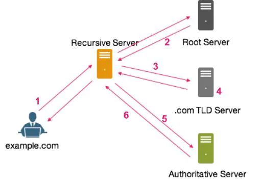
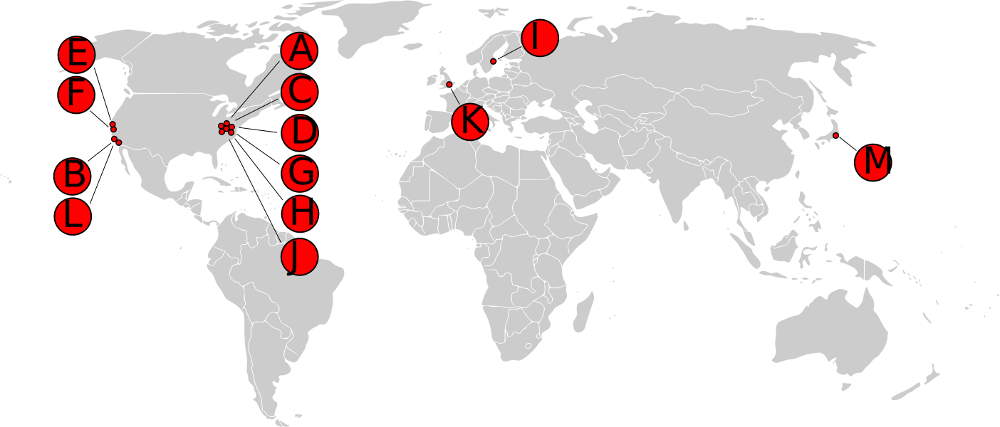

# DNS
Il DNS (**Domain Name Service**) viene utilizzato per la risoluzione di nomi degli host in indirizzi IP e viceversa. Ad ogni indirizzo web corrisponde un unico indirizzo IP, ad **esempio**: `http://www.google.it <=> http://216.58.210.195`.

DNS è un **database distribuito** che memorizza coppie (nome simbolico-indirizzo) e ad ogni dominio corrisponde un nameserver, che conserva un database con le informazioni di alcuni domini di cui è responsabile e si rivolge agli host successivi quando deve trovare informazioni che appartengono ad altri domini. Tale protocollo utilizza [UDP](/01-introduction-and-fundamentals/02-introduction-to-networks/README.md) e lavora sulla **porta 53**.

Anche ai PC di una **rete LAN** viene associato un nome simbolico corrispondente al rispettivo IP impostato nella scheda di rete. Generalmente l'associazione viene fatta tramite un file "hosts" composto da coppie di dati:
```
192.168.1.1   server
192.168.1.77  pc-lorenzo
192.168.1.29  pc
```

In un sistema GNU/Linux queste informazioni si trovano nel file `/etc/hosts`, vedremo che ci tornerà utile quando dovremo effettuare determinati attacchi!

Supponiamo di inserire nella barra di ricerca www.example.com. Il client HTTP attiva un client DNS che:
1. Estrae dall’URL il nome simbolico del server "example.com" 
2. Interroga la **cache** del servizio DNS locale e ottiene l’indirizzo IP corrispondente al nome simbolico e invia una richiesta al web server (passa l’indirizzo IP al livello transport ecc..).
3. Se il DNS locale non riesce a tradurre il nome simbolico in un indirizzo IP viene effettuata un’operazione di **ricorsione**.
4. Viene contattato un **server DNS radice** (root server) per conoscere il server di primo livello (.com, .net, .edu, .it ecc..) che lo gestisce.
5. Poi quest’ultimo viene interrogato per il dominio di **secondo livello** e così via fino a raggiungere il server autoritativo per il nome desiderato (www.example.com) restituendo la mappatura al DNS locale.

<figure class="image" align="center">
  
  <figcaption>Schema funzionamento DNS</figcaption>
</figure>


I **Root server** sono i primi server autoritativi che **possiedono l'elenco dei server autoritativi di tutti i domini di primo livello TLD** (Top Level Domain) riconosciuti e lo forniscono in risposta a ciascuna richiesta. I root nameserver **sono 13 in tutto il mondo**, di cui 10 negli Stati Uniti, due in Europa (Inghilterra e Svezia) e uno in Giappone.

<figure class="image" align="center">
  
  <figcaption>Root Servers</figcaption>
</figure>


> La lista dei Root Server con i rispettivi operatori è disponibile in [questa](https://www.iana.org/domains/root/servers) pagina.