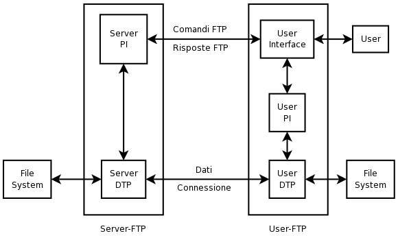

# FTP
Il protocollo FTP (**File Transfer Protocol**) permette di scaricare, caricare e modificare file presenti in un server. Tale protocollo utilizza **due canali TCP** separati che agiscono in parallelo per la connessione di controllo e la connessione dati:
1. La prima connessione, che lavora sulla porta 21, è usata per spedire le informazioni di **controllo** tra client/server come username, password e comandi per la gestione della Directory remota.
2. La seconda connessione, che lavora sulla porta 20, è effetticamente usata per il trasferimento dei file e viene detta **Data Connection**.

<figure class="image" align="center">
  
  <figcaption>Funzionamento FTP</figcaption>
</figure>

Il protocollo FTP si riferisce al modello **client-server** nel quale la macchina host destinata a svolgere la funzione di server ha in esecuzione uno specifico programma, che può essere fornito dal sistema operativo oppure installato in un secondo tempo. Per poter usare la connessione ftp in entrambe le macchine deve essere installato un software FTP, uno dei più famosi è [Filezilla](https://filezilla-project.org/).

> **Nota**: L’accesso al ftp server viene effettuato tramite un sistema di autenticazione. Possono essere assegnati privilegi agli utenti registrati per operare sul filesystem della macchina. È possibile effettuare l’**autenticazione anonima** che non prevede nessuna password segreta di accesso (nomeutente: anonymous). Il client che si connette avrà solo i privilegi di lettura.

## FTPs
**Il protocollo FTP non prevede alcuna cifratura** per i dati scambiati tra Client e Server. Il nomeutente, la password, i comandi e i codici di risposta possono essere facilmente rubati dai malintenzionati. Per risolvere il problema della sicurezza è stata ideata una nuova specifica RFC 4217 che aggiunge al protocollo uno strato di cifratura [SSL](/01-introduction-and-fundamentals/03-encryption/03-asymmetric-key/README.md) con una relativa serie di comandi e codici di risposta. Tale protocollo si chiama **FTPS**.

## SFTP
SFTP indica il trasferimento di file sicuro tramite [Secure Shell](../ssh/README.md) (o SSH), da qui il nome SSH File Transfer Protocol (SFTP). I due dispositivi (server e client) comunicano tramite un unico canale, quello di SSH, in cui vengono inviati i comandi di gestione dei file remoti e dove avviene il trasferimento dei file. L’unica porta necessaria per SFTP è di default la 22, la stessa di SSH. SFTP implementa a livello di crittografia le stesse specifiche supportate da SSH, anche TLS 1.2.

**Quale scegliere?**
Date le definizioni qui sopra riportate, la scelta ovvia in termini di sicurezza ricade sicuramente su SFTP o FTPS. Utilizzando il servizio SFTP rispetto a FTPS potrebbe portare dei vantaggi in termini di tempo necessario per la configurazione del servizio: avengo già configurato SSH l'implementazione del servizio SFTP risulta essere la più veloce!

## CLI
Nonostante esistano molti programmi grafici (GUI) potrebbe tornarci utile conoscere i comandi per gestire una connessione FTP tramite Shell di Linux.

Per conoscere tutte le **Flag** che FTP dispone possiamo utilizzare il comando `man ftp` per una lista completa.

Per **accedere** a un server FTP tramite autenticazione possiamo utilizzare il seguente comando: `ftp <IP> <PORT>` andando a sostituire `<IP>` e `<PORT>` con i valori relativi al server.

Se sono stati inseriti tutti i dati correttamente, abbiamo stabilito la connessione FTP e a questo punto possiamo eseguire i seguenti comandi:

| Comando | Descrizione |
| :----: | ------|
|`!`| Se utilizzato permette di passare temporaneamente alla CLI del Sistema Operativo. Quando si utilizza il Sistema Operativo, digitando `exit` si torna alla riga di comando FTP.|
|`?`| Permette di accedere alla schermata di guida. |
|`append`| Appende del testo a un file locale |
|`cd`| Cambia directory |
|`close`| Chiude la connessione FTP |
|`delete`| Permette di eliminare un file |
|`dir`| Elenca i file |
|`get`| Prende il file dal computer collegato |
|`ls`| Elenca i file del server connesso in remoto |
|`mkdir`| Crea una directory |
|`put`| Invia un file |
|`rename`| Rinomina un file del server connesso in remoto |
|`send`| Invia un singolo file |

È possibile consultare la lista completa dei comandi in [questa](https://www.computerhope.com/unix/ftp.htm) pagina.