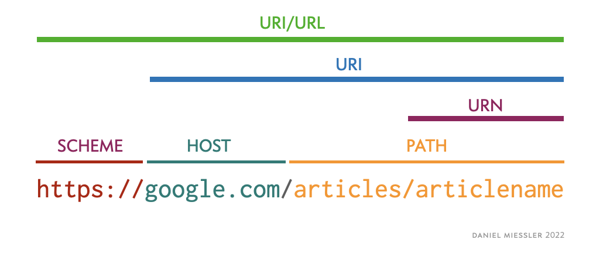
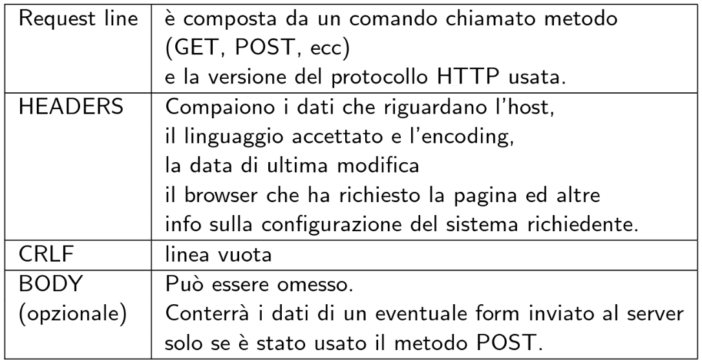
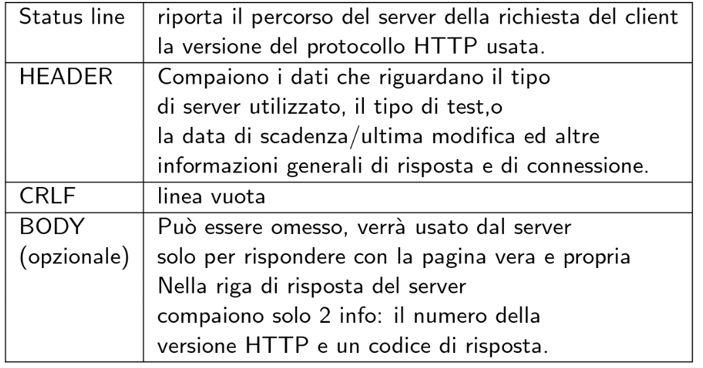

# HTTP(s)
Il **protocollo HTTP** (HyperText Transfer Protocol) definisce come i messaggi vengono passati fra browser e server Web ed utilizza l’architettura Client-Server. Il protocollo HTTP è definito sul RFC 1945 (ver. 1.0) e sul RFC 2616 (ver. 1.1).

La **risorsa** più comune è rappresentata da un file ma potrebbe essere anche il risultato di una query generata dinamicamente o l’output di uno script. Una risorsa è identificata da un **URI** (Uniform Resource Identifier ovvero l’insieme di tutti i nomi/indirizzi che si assegnano alle risorse) e da un **URL** (Uniform Resource Locator, utilizzato per indicare i protocolli URI più noti: HTTP, FTP, mailto, ecc).

<figure class="image" align="center">
  
  <figcaption>URI e URL</figcaption>
</figure>

### HTTPS
Si riferisce al protocollo HTTP (Hyper Text Transfer Protocol) utilizzato in combinazione con lo strato **SSL o TLS**. La porta standard dedicata a questo servizio è la 443. 
Viene creato un **canale di comunicazione criptato** tra il client e il server attraverso lo scambio di certificati garantendo che solamente essi siano in grado di conoscere il contenuto della comunicazione.

## Connessione HTTP(s)
La comunicazione avviene attraverso il protocollo **TCP** del livello transport utilizzando gli indirizzi IP del computer del client e server. L’HTTP lavora di default sulla **porta** 80 o, nel caso del protocollo HTTPS sulla porta 443.

L’HTTP può impiegare sia la **connessione non permanente** sia quella **permanente**. La connessione creata da HTTP 1.0 è di tipo non permanente. Invece la modalità di default per HTTP 1.1 è di tipo permanente: il server non chiede la chiusura della connessione TCP se non dopo che è scaduto un time-out durante il quale la connessione non è utilizzata. 

## Cookies
I **cookies** sono **file memorizzati nel computer del client** e sono una parte fondamentale del protocollo HTTP(s), poiché inseriti in ogni richiesta HTTP. Quando l’utente si ricollega al sito il contenuto del file viene inviato al server che lo analizza e ne estrae le informazioni memorizzate in modo da presentare le informazioni personalizzate. Questi permettono di effettuare **Tracking** del comportamento dell'utente, di mostrare informazioni personalizzate (**Personalization**) e di gestire la sessione per identificare l'utente (**Session management**).

**Esempio** di Cookie: `username=LorenzoVaccher01; expires=Thu, 21 Dec 2027 18:30:00 UTC; path=/`
Nella stringa mostrata possiamo inserire ulteriori parametri oltre al nome e al valore del Cookie, tra cui:
- `Expires`: definisce il tempo di vita del Cookie.
- `Max-Age`: definisce il tempo di vita del Cookie. Se nel Cookie è specificato sia il parametro Expires e Max-Age quest'ultimo ha la priorità.
- `Path`: definisce il Path
- `Domain`: specifica quale host può ricevere il cookie.
- `Secure`: il cookie viene inviato solo tramite HTTPS (in localhost può essere inviato anche tramite HTTP).
- `HttpOnly`: tramite questo parametro il client (tramite JavaScript) non può modificare il valore del Cookie, permette di mitigare attacchi XSS (Cross-Site Scripting)!
- `SameSite`: L'attributo SameSite consente ai server di specificare se/quando i cookie vengono inviati con richieste tra siti. Ciò fornisce una certa protezione contro gli attacchi di falsificazione delle richieste tra siti (CSRF). Sono necessari tre valori possibili: `Strict` (inviato solo al sito dove è stato creato), `Lax` (default, simile a Strict ma i cookie vengono inviati quando l'utente naviga sul sito di origine del cookie) e `None`.

## Cache
La cache HTTP archivia una risposta associata a una richiesta e riutilizza la risposta archiviata per le richieste successive.

> Per approfondire l'argomenti consigliamo di leggere [questo](https://developer.mozilla.org/en-US/docs/Web/HTTP/Caching) articolo di deverloper.mozilla.org

## Richiesta e risposta
I messaggi inviati/ricevuti con il protocollo HTTP sono un insieme di righe di caratteri **ASCII**.

|Richiesta|Risposta|
|:-:|:-:|
| | | 

#### Metodi di richiesta
- **OPTIONS** → mostra quali sono i metodi supportati dal server. 
- **GET** → richiede una risorsa (file, documenti, pagine HTML) al server localizzato con una Request-URI. 
- **HEAD** → funziona in maniera analoga a GET con la differenza che il server non rimanda l’oggetto richiesto (il server inserisce solo le intestazioni nel suo messaggio di risposta e sarà assente il body). 
- **POST** → il client può spedire al server informazioni che dovrà processare (solitamente utilizzato per la registrazione e autenticazione degli utenti). 
- **PUT** → utilizzato per aggiornare delle risorse già presenti nel server. 
- **DELETE** → richiede che il server ricevente cancelli le risorse indicate.
- **TRACE** → si tratta di un ping che verifica quali dati il server web riceve dal client. Il server ritorna esattamente ciò che riceve. 
- **CONNECT** → viene usato per instaurare una connessione con un proxy server. 

GET, PUT, HEAD, DELETE, OPTIONS e TRACE sono **metodi idempotenti** poiché più richieste uguali producono lo stesso risultato.

### Status codes
|Stato|Descrizione|
|:-:|--|
|`100`| Continue |
|`200`| Ok |
|`301`| Moved Permanently |
|`302`| Found (Previously “Moved Temporarily”)|
|`401`| Unauthorized|
|`403`| Forbidden|
|`404`| Not Found|
|`500`| Method Not Allowed|
|`501`| Internal Server Error|
|`502`| Not Implemented|
|`503`| Service Unavailable|

> Una lista completa degli stati è disponibile [qui](https://en.wikipedia.org/wiki/List_of_HTTP_status_codes).

**In linea generale:**
- 1xx → Stati generali
- 2xx → Stati di successo
- 3xx → Stati di reindirizzamento
- 4xx → Errori del client
- 5xx → Errori del server

### Request Header Fields
Di seguito sono riportati i campi più importanti che possono essere aggiunti alle richieste effettuate dal client verso il server. 
#### Host (obbligatorio)
Il **nome di dominio** ed eventualmente la porta TCP del server al quale si vuole effettuare la richiesta. La porta può essere omessa se si tratta di una porta standard (80 HTTP e 443 HTTPS). 
**Esempi**: 
- `Host: wikipedia.org:8080`
- `Host: amazon.dom`

#### User-Agent
[Stringa caratteristica](https://developers.whatismybrowser.com/useragents/explore/) che consente al server e ai peer di rete di **identificare l’applicazione**, il sistema operativo, il fornitore e/o la versione dell’agente utente richiedente.
**Esempi**: 
- `User-Agent: Mozilla/5.0 (X11; Linux x86_64; rv:12.0) Gecko/20100101 Firefox/12.0`

#### Accept
Questo campo esprime il **tipo di contenuto**, espresso secondo lo standard [MIME](#mime), che il client è in grado di comprendere e che si aspetta come risposta alla richiesta.
**Esempi**: 
- `Accept: text/html`

#### Accept-language
Tale campo esprime le **lingue** che il client è in grado di comprendere e quale variante locale è preferita.
**Esempi**:
- `Accept-Language: *`
- `Accept-Language: it-IT`

#### Accept-encoding
Accept-Encoding annuncia al server quale **codifica del contenuto**, di solito quale algoritmo di compressione, il client è in grado di comprendere. Tipi di compressione accettati: gzip, compress, deflate, br, identity, *
**Esempi**:
- `Accept-Encoding: gzip, deflate, identity, br`

#### Connection
Opzioni di **controllo** per la **connessione** corrente ed una lista di campi di richiesta hop-by-hop. Il server utilizza un Socket per la connessione; il socket può essere mantenuto valido per una o più richieste HTTP/HTTPS. 
Nelle richieste a pagine statiche tipicamente si imposta il campo connection a close.
**Questo campo non può essere utilizzato con la versione 2 di HTTP (HTTP/2).**

**Valori validi**:
- `keep-alive` → Mantiene viva la connessione tra server e client. Questo è utile quando nel sistema client-server vi sono numerose richieste e ciò permette di ridurre i tempi relativi alla connessione, risparmiando rete, CPU e RAM del server.
Se la connessione scelta è di tipo Keep-alive, allora nella richiesta ci deve essere (non obbligatoriamente) anche il campo Keep-alive nella lista dei parametri della richiesta stessa. Tale campo accetta i seguenti valori:
  - `timeout` → indica il tempo minimo per cui una connessione inattiva deve essere tenuta aperta (in secondi). Notare che i timeout più lunghi del timeout TCP possono essere ignorati se nessun messaggio TCP keep-alive è impostato a livello di trasporto.
  - `max` → indica le richieste massime che possono essere inviate sulla connessione prima di chiuderla.
- `close` → Chiude la connessione quando il client ha ricevuto una risposta dal server.

**Esempi**: 
- `Connection: keep-alive`
- `Keep-Alive: timeout=5, max=1000`
- `Connection: close`

#### Origin 
Indica da dove ha origine la richiesta fetch. Non include alcuna informazione sul percorso, ma solo il nome di dominio. Viene inviato con le richieste CORS, nonché con le richieste POST. È simile all’intestazione referer ma, a differenza di quest’ultima, non viene inserito l’intero percorso della pagina.
**Esempi**: 
- `Origin: http://www.example.com`

#### Referer
L’indirizzo della pagina precedente dalla quale è stato cliccato il link che porta alla pagina corrente. L'intestazione Referer consente ai server di identificare da dove le persone stanno visitando e possono utilizzare tali dati per analisi, registrazione o memorizzazione nella cache ottimizzata, ad esempio.
**Esempi**: 
- `Referer: http://en.wikipedia.org/wiki/Main_Page`
- `Referer: https://lorenzovaccher.com/index.html`

#### Content-Type
Il tipo del body della richiesta (usato con le richieste POST e PUT). I valori di tale campo seguono lo standard [MIME](#mime).
**Esempi**: 
- `Content-Type: application/x-www-form-urlencoded`
- `Content-Type: text/html; charset=UTF-8`

#### Cookie
Un cookie precedentemente inviato dal server usando il Set-Cookie
**Esempi**: 
- `Cookie: $Version=1; Skin=new; session=91823ajshgdlalsd;`

### Response Headers Field
Di seguito sono riportati alcuni campi che il server può inserire nella risposta da inviare al client.

#### Connection
Gestisce le opzioni per la connessione corrente e l’elenco dei campi di risposta “hop-by-hop”. Controlla se la connessione deve rimanere aperta o meno dopo che la transazione (di HTTP) corrente finisce.
**Esempi**:
- `Connection: close`
- `Connection: keep-alive`
  
#### Content-Encoding
Il tipo di **codifica** utilizzato sui dati. Quando compare il suo valore indica quali codifiche sono state applicate al corpo del messaggio. Permette al client di sapere come decodificare i dati per ottenere il tipo di file indicato nell’header Content-Type.
**Esempi**:
- `Content-Encoding: gzip`
  
#### Content-Length
Indica la lunghezza del corpo della risposta in bytes.
**Esempi**:
- `Content-Length: 348`

#### Content-Type
Indica il tipo [MIME](#mime) del contenuto del corpo della risposta.
**Esempi**:
- `Content-Type: text/html; charset=utf-8`
  
#### Set-Cookie
Viene utilizzato per inviare un [cookie](#cookies) dal server allo user agent del client, cosicché lo user agent possa reinviarlo al server successivamente.
**Esempi**:
- `Set-Cookie: UserID=JohnDoe; Max-Age=3600; Version=1`

### CORS
Le richieste Cross Origin, effettuate dai client tramite richiesta HTTP(s), vengono utilizzate per bloccare o abilitare l’accesso ad una risorsa esterna al sito da cui si effettua la richiesta. Le risposte richieste da risorse esterne al sito in cui si effettua la fetch, vengono chiamate **Cross-origin Requests**, le quali comprendono specifici campi nell’header di una risposta HTTP, chiamati **Cors Headers** che esprimono per la possibilità di utilizzare una risorsa proveniente da un server differente da dove si trova il sito raggiunto dall’utente.

<figure class="image" align="center">
  
  <figcaption>CORS, <a href="https://developer.mozilla.org/en-US/docs/Web/HTTP/CORS">developers.mozilla.org</a></figcaption>
</figure>

Nell’immagine soprastante vengono mostrate diverse richieste per accedere a risorse presenti in due server diversi. Le risposte del server doman-a.com, vengono definite Same Origin Request (che permettono di specificare diverse Policy, chiamata **Same Origin Policy**) in quanto provengono dallo stesso dominio del server. Per quanto riguarda le risorse che vengono richieste al sito con dominio domain-b.com, vengono applicate le **Cors Policy** (attraverso determinati Cors Header) in quanto queste ultime provengono da una risorsa esterna.

Cenni sulle **Cors Policy**:
- `Access-Control-Allow-Origin`: specifica quale origine è consentita
- `Access-Control-Allow-Credentials`: le richieste sono consentite anche se la modalità credenziali è impostata su include?
- `Access-Control-Allow-Headers`: specifica quali intestazioni possono essere utilizzate
- `Access-Control-Allow-Methods`: specifica quali metodi di richiesta HTTP sono consentiti
- `Access-Control-Expose-Headers`: specifica quali intestazioni possono essere visualizzate
- `Access-Control-Max-Age`: specifica qual è il tempo massimo della preflight request prima che scada
- `Access-Control-Request-Headers`: quale intestazione HTTP è specificata nella preflight request
- `Access-Control-Request-Method`: quale metodo HTTP è specificato nella preflight request?

### MIME
I tipi MIME, o Multipurpose Internet Mail Extensions sono degli standard che specificano la natura e il formato di un documento, file o assortimento di byte. Si dividono in type e subtype

#### Application
- `application/javascript` → versione aggiornata del MIME type “text/javascript”. Utilizzato per file .js o .mjs (JavaScript Module)
- `application/json` → utilizzato per file .json
- `application/x-www-form-urlencoded` → utilizzato per trasferire messaggi dopo che sono stati convertiti in base alle specifiche degli URL (spazio = %20; coppie nome valore separate da &; nome assegnato a valore tramite =)

#### Text
- `text/css` → utilizzato per file .css
- `text/html` → utilizzato per file .html o .htm

#### Image
- `image/png` → utilizzato per trasferire stringhe che rappresentano immagini nel formato .png
- `image/jpeg` → utilizzato per trasferire stringhe che rappresentano immagini nel formato .jpeg o .jpg
- `image/gif` → utilizzato per trasferire stringhe che rappresentano immagini nel formato .gif