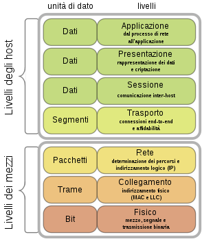
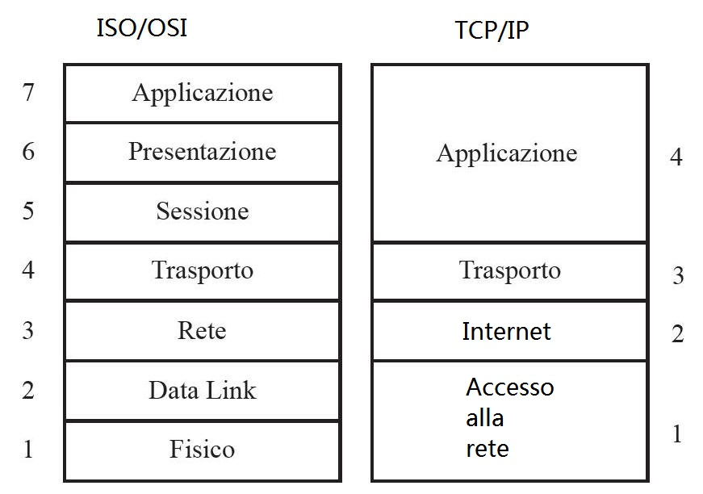

# Networks
Una rete informatica, o rete di computer, è un insieme di dispositivi hardware (Router, Switch, Access Point, Firewall) interconnessi attraverso appositi canali di comunicazione, come per esempio cavi Ethernet o reti Wireless, che permettono lo scambio di risorse. 

## Componenti fisici di una rete
Le reti di computer contengono diversi dispositivi che si interpongono tra i dispositivi di host. Questi dispositivi intermedi assicurano il flusso dei dati da un dispositivo host all’altro. I dispositivi intermedi più comuni sono:
- **Modem**: consente di convertire i dati digitali di un computer in un formato che può essere trasmesso sulla rete dell’ISP. Esistono tre diverse tipologie di Modem: ADSL, VDSL, HFC.
- **Router**: consente di inoltrare il traffico tra le reti (funge da instradatore). I router utilizzano indirizzi IP per inoltrare il traffico ad altre reti. 
- **Switch**: questo dispositivo permette di connettere più calcolatori. Un dato inviato da un calcolatore viene ricevuto da uno o più calcolatori. A differenza dell’hub lo switch è più performante in quanto fornisce una maggiore larghezza di banda dedicata a ciascun dispositivo della rete. 
- **Access Point** (AP): fornisce connettività wireless ma ha meno funzioni rispetto a un router wireless: non instrada le informazioni.
- **Bridge**: dividono una rete in più segmenti. I segmenti vengono gestiti da un hub. Un bridge può quindi filtrare il traffico di rete tra i segmenti della LAN.
- **Patch panel**: Un patch panel è generalmente utilizzato come punto di raccolta dei cavi provenienti dai vari dispositivi di rete di un'infrastruttura. Esso fornisce un punto di connessione tra PC e switch o router.
- **POE**: Uno switch POE (Power Over Ethernet) insieme ai dati trasferisce piccole quantità di corrente continua tramite un cavo ethernet per alimentare dispositivi come telecamere di videosorveglianza, telefoni IP o Access Point (AP).
- **Firewall**: un firewall (muro di fuoco) è un software che gira all’interno di un calcolatore (computer) o nei router (solitamente nelle abitazioni) che protegge i dati e le apparecchiature di una rete da accessi non autorizzati.

## Larghezza di banda e latenza
La **larghezza di banda** in una rete è la quantità di dati che un Host può trasmettere in un’unità di tempo (una banda stretta trasmette meno informazioni rispetto a una banda larga), in genere si misura in bit/secondo o i suoi multipli (kbit/s, Mbit/s, Gbit/s).

La **latenza** è il tempo di risposta tra due calcolatori, normalmente si misura in Ms (millisecondi).

## Tipi di rete
- **LAN** (Local Area Network) è una rete che si estende entro un’area geografica limitata. le LAN sono generalmente di proprietà di un singolo, ad esempio all'interno di una casa o di una piccola impresa.
- **PAN** (Personal Area Network) è una rete che connette dispositivi (es: mouse, tastiera, stampanti, ecc ecc) entro una portata ridotta. Tutti questi dispositivi sono dedicati a un singolo host e nella maggior parte dei casi sono connessi mediante tecnologia Bluetooth.
- **MAN** (Metropolitan Area Network) è una rete che si estende su un campus universitario di grandi dimensioni o su una città. La rete è costituita da vari edifici connessi tra loro mediante backbone in fibra ottica o wireless.
- **WAN** (Wide Area Network) connette più reti che si trovano in aree geograficamente separate.
- **GAN** (Global Area Network) è una rete estesa a tutto il globo (Internet!).

## Standards
Un protocollo è un insieme di regole che permettono la comunicazione tra i computer di una rete.
**Funzioni dei protocolli**:
- Identificazione e gestione degli errori.
- Compressione dei dati.
- Determinazione del modo in cui devono essere suddivisi e predisposti i dati.
- Indirizzamento dei pacchetti di dati.
- Seterminazione del modo in cui devono essere annunciati l’invio e la ricezione dei pacchetti i dati.

### Modello ISO/OSI
La comunicazione OSI (Open System Interconnect) fu creata per standardizzare le comunicazioni tra dispositivi. Questo modello è suddiviso in sette livelli di rete:

<figure class="image" align="center">
  
  <figcaption align="center">ISO/OSI Model, <a href="https://it.wikipedia.org/wiki/Modello_OSI">wikipedia.org</a></figcaption>
</figure>

1. **Livello Fisico**: si occupa della trasmissione di ogni singolo bit attraverso un canale di comunicazione.
2. **Livello Collegamento Dati**: si occupa di indirizzare correttamente i dati grazie al MAC Address.
3. **Livello Rete**: I protocolli appartenenti a questo livello servono a rendere quelli superiori indipendenti dai mezzi fisici utilizzati per la comunicazione tra i due punti della rete. Si occupa, quindi, dell’attività di routing (instradamento, inteso come individuazione del percorso di rete da utilizzare per la consegna dei pacchetti) e della conversione dei dati nel caso in cui i due nodi siano ospitati da reti con caratteristiche differenti
4. **Livello di trasporto**: I protocolli di questo Layer hanno il compito di determinare tutto ciò che riguarda la connessione tra i due host (sorgente e destinatario). Stabiliscono, mantengono e terminano la connessione, che deve essere affidabile e duratura per assicurare la corretta trasmissione dei dati e allo stesso tempo non durare più dello stretto necessario per evitare di congestionare la rete.  
Due protocolli che operano al livello trasporto sono **TCP** (Transmission Control Protocol) e **UDP** (User Datagram Protocol). TCP è considerato un protocollo del livello trasporto affidabile e completo, in grado di garantire che tutti i dati arrivino a destinazione. UDP invece è un protocollo del livello trasporto molto semplice che non offre alcuna affidabilità.
5. **Livello Sessione**: Si occupa di instaurare, mantenere e abbattere connessioni tra applicazioni cooperanti (sessioni). 
6. **Livello Presentazione**: I protocolli appartenenti a questo Layer consentono di trasformare i dati delle applicazioni in un formato standard e offrire servizi di comunicazione comuni, come la crittografia e la formattazione.
7. **Livello Applicazione**: questo livello contiene tutti i servizi e i protocolli per l’utilizzo della rete (SSH. FTP, ICMP, POP3, IMAP, ecc.).

### Modello TCP/IP
Lo standard ISO/OSI è un modello concettuale che oggigiorno non viene impiegato per la comunicazione dei dati tra elaboratori. Cioò che viene utilizzato è lo standard TCP/IP che si basa sullo standard ISO/OSI ma che a differenza di quest'ultimo è composto da solo 4 livelli.

<figure class="image" align="center">
  
  <figcaption align="center">ISO/OSI vs TCP/IP</figcaption>
</figure>

Il modello TCP/IP presenta due protocolli nella suite: **TCP** (Transmission Control Protocol) e **ISP** (Internet Protocol). TCP è responsabile della consegna affidabile mentre il protocollo IP è responsabile dell’aggiunta degli indirizzi sorgente e di destinazione dei dati, questo modello include altri protocolli.

### MAC Address e IP
L'indirizzo **MAC** (Media Access Control) è un codice Hardcoded nella scheda di interfaccia di rete (NIC) dal produttore e rimane associato al dispositivo indipendentemente dalla rete a cui il dispositivo è connesso, tuttavia modificabile a livello software. Un indirizzo MAC è di 48 bit e può essere rappresentato in uno dei tre formati esadecimali. In tale formato (quello attualmente più diffuso), i 48 bit del codice sono suddivisi in 12 cifre esadecimali: le prime 6 cifre individuano il produttore dell'interfaccia di rete mentre le successive corrispondono al numero di serie della scheda stessa.

**Internet Protocol** (IP): Un indirizzo IPv4 ha una lunghezza di 32 bit (4 miliardi di combinazioni possibili) ed è rappresentato con la notazione detta dotted decimal. Un indirizzo IPv6 ha una lunghezza di 128 bit (340 undicilioni di combinazioni di indirizzi) ed è rappresentato in formato esadecimale. Questo indirizzo (indipendentemente che sia IPV4 o IPV6) permette di identificare un Host all'interno di una rete.

> **NB**: Ogni Host per poter comunicare ha bisogno di un indirizzo IP. Nelle prossime lezioni vedremo come è possibile convertire un Dominio in indirizzo IP, per esempio: amazon.dom => 176.32.103.205

//TODO: parlare anche di porte!!!!

## Gateway
//TODO: da fare!
