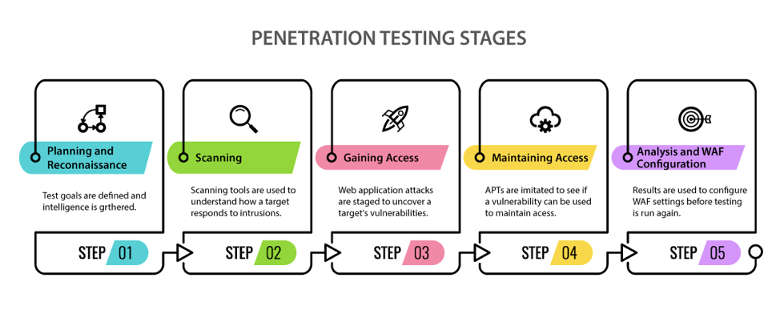

# Cybersecurity
Appunti dedicati allo studio dei principali strumenti e metodi utilizzati nella **Sicurezza Informatica** e nel **Penetration Testing**. Chiunque volesse dare un contributo a questo progetto con aggiornamenti o aggiunte è libero di farlo!

<figure class="image" align="center">
  
</figure>

# Indice
1. [Introduzione e fondamenti](01-introduction-and-fundamentals/)
   1. [Fondamenti di Linux](01-introduction-and-fundamentals/01-linux-fundamentals/README.md)
      1. Gestione degli utenti
      2. Gestione dei permessi
      3. Gestione dei processi
   2. [Introduzione alle reti](01-introduction-and-fundamentals/02-introduction-to-networks/README.md)
      1. [Principali protocolli utilizzati](01-introduction-and-fundamentals/02-introduction-to-networks/01-main-protocols-used/README.md)
           1. IEEE 802.3
           2. ICMP
           3. [DNS](/01-introduction-and-fundamentals/02-introduction-to-networks/01-main-protocols-used/dns/README.md)
           4. [SSH](/01-introduction-and-fundamentals/02-introduction-to-networks/01-main-protocols-used/ssh/README.md)
           5. [FTP](/01-introduction-and-fundamentals/02-introduction-to-networks/01-main-protocols-used/ftp/README.md)
           6. [HTTP](/01-introduction-and-fundamentals/02-introduction-to-networks/01-main-protocols-used/http/README.md)
           7. [SMTP](/01-introduction-and-fundamentals/02-introduction-to-networks/01-main-protocols-used/smtp/README.md)
      2. Sicurezza Hardware di una rete
         1. Firewall
         2. VLAN
         3. Proxy e VPN
   3. Crittografia
      1. Giulio Cesare
      2. Chiave simmetrica
      3. Chiave asimmetrica
2. Strumenti utili
   1. [NMAP](02-useful-tools/01-nmap/README.md)
   2. PostMan
   3. [Metasploit](02-useful-tools/03-metasploit/README.md)
   4. SQLMap
   5. Wireshark
   6. Hashcat
3. Attacchi base
   1. SQL Injection
   2. Login Brute Forcing
   3. XSS (Cross-Site Scripting)
   4. File Upload Attacks
   5. Templcate Attack